[Русская версия](README.ru.md)

# 2DTanks

2DTanks is a browser-based multiplayer tank game developed as a diploma project on the JavaScript/TypeScript stack. The project demonstrates real-time multiplayer interaction, an authoritative server-side game simulation, collision handling, persistence, and a React web client that runs without a native game installer.

The main engineering problem is keeping several players in one shared physical world consistent. Clients send input events, the server validates them and advances the authoritative world state, then broadcasts synchronized snapshots to connected players over WebSocket.

## Features

- Account registration, login, JWT authentication, and editable user profiles.
- Online rooms for solo practice, multiplayer matches, spectators, lobby chat, invitations, and reconnects.
- Real-time gameplay over WebSocket with server-side room lifecycle and state synchronization.
- Tank customization: hull, tracks, turret, weapon, color, named presets, and derived stats.
- 2D movement, shooting, destructible objects, items, collision detection, and match results.
- Friends, user search, public replay gallery, replay sharing, likes, and playback.
- PostgreSQL persistence for users, profiles, friendships, tank presets, matches, replay events, and statistics.
- Docker Compose setup for PostgreSQL, the Node.js server, and the Nginx-served frontend.

## Screenshots

| Login | Registration |
| --- | --- |
| 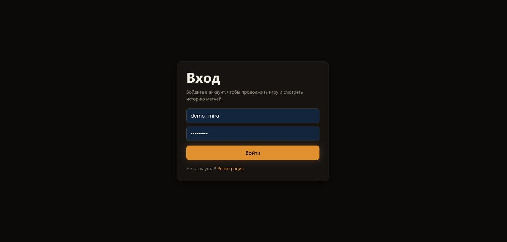 | 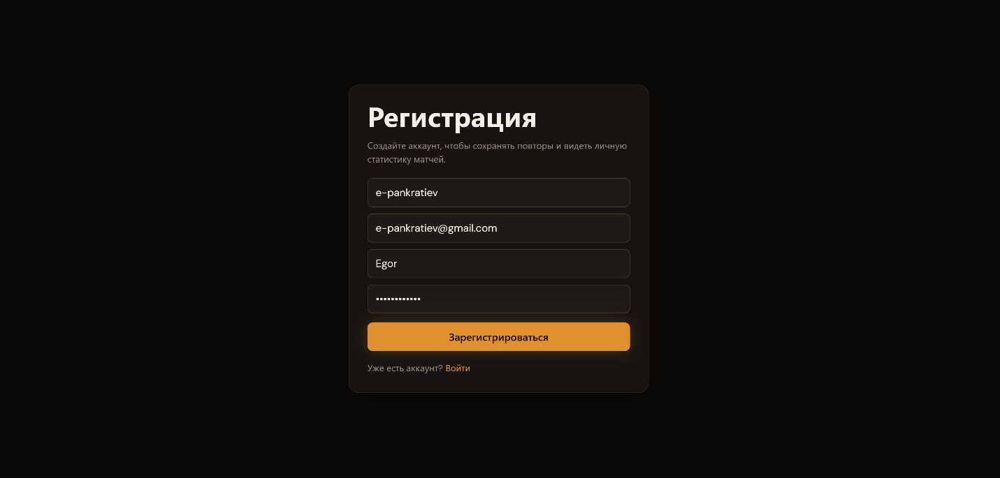 |

| Home | Play mode |
| --- | --- |
| 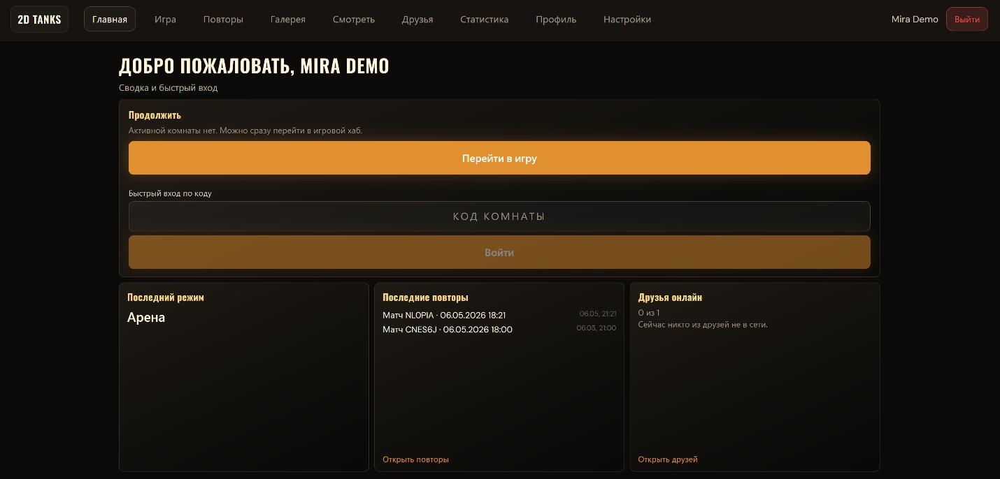 | 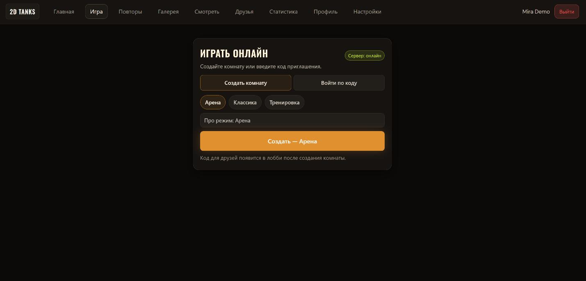 |

| Tank customization | Room |
| --- | --- |
| 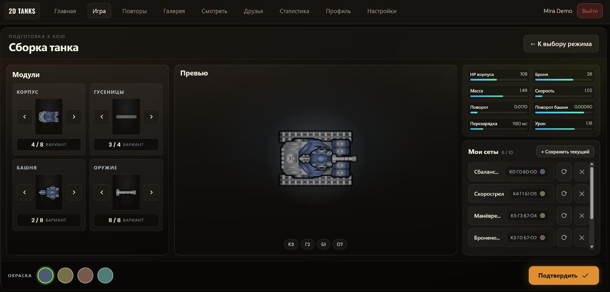 | 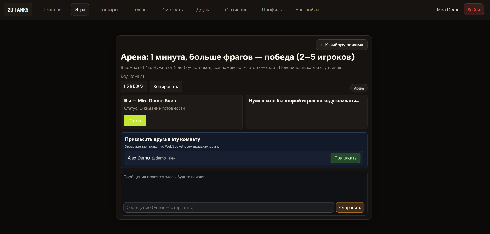 |

| Gameplay | Match results |
| --- | --- |
| 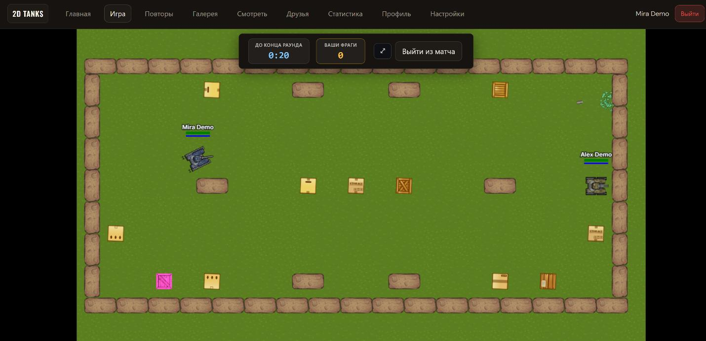 | 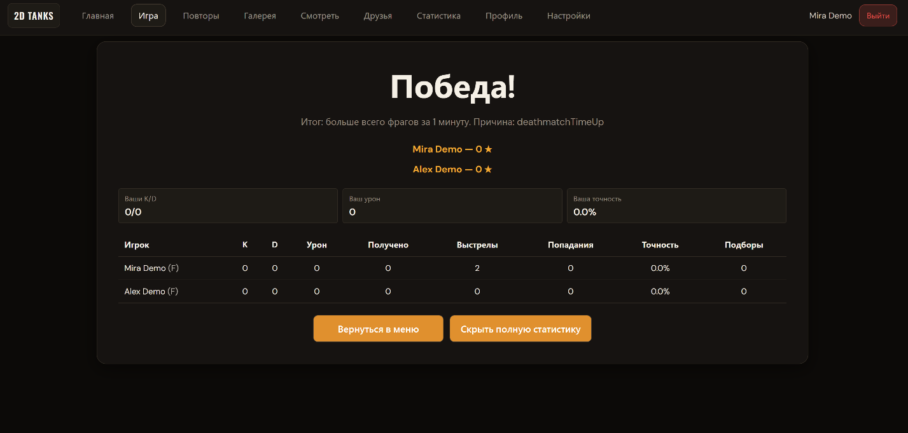 |

| Replays | Replay viewer |
| --- | --- |
| 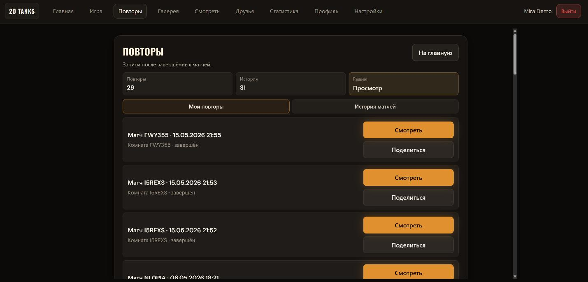 | 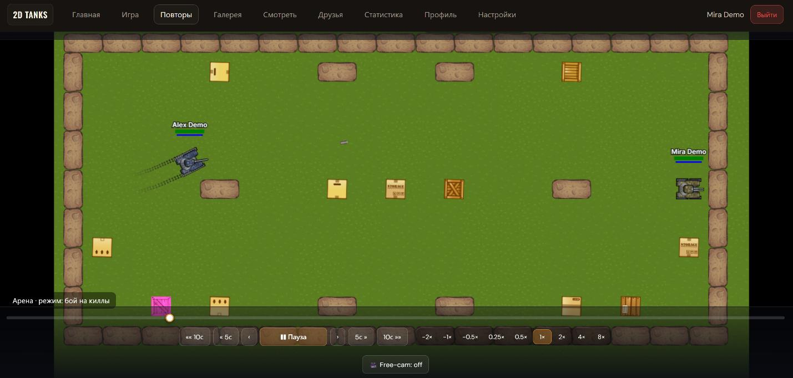 |

| Friends | Settings |
| --- | --- |
| 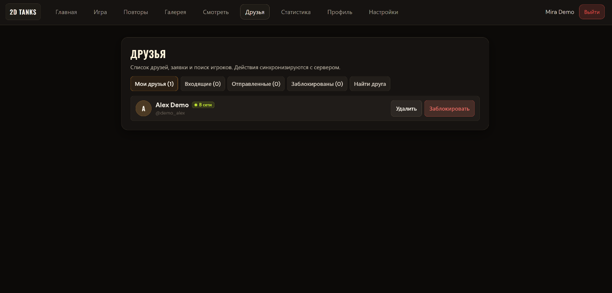 | 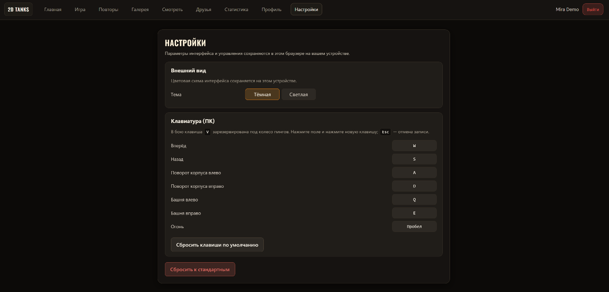 |

## Architecture

The application uses a client-server architecture with an authoritative game server.

- **Frontend**: a React and TypeScript single-page application. It handles routing, auth state, UI screens, user input, WebSocket communication, canvas/sprite rendering, audio, and replay playback.
- **Server**: a Node.js and TypeScript application. Express provides the REST API, while `ws` handles real-time game connections. The server owns rooms, sessions, player state, simulation ticks, collision checks, snapshots, chat, pings, invitations, spectators, and reconnect logic.
- **Database**: PostgreSQL stores long-lived application data: accounts, profiles, friends, tank presets, match metadata, replay input/events, likes, and match statistics.
- **Docker runtime**: Nginx serves the built frontend and proxies `/api` and `/game` to the server, so the browser can work through a single origin on port `5173`.

## Data Model

The database schema centers on users and matches. Users have profiles, friends, and tank presets; matches contain participants, recorded inputs, replay metadata, replay event payloads, and public-gallery data.

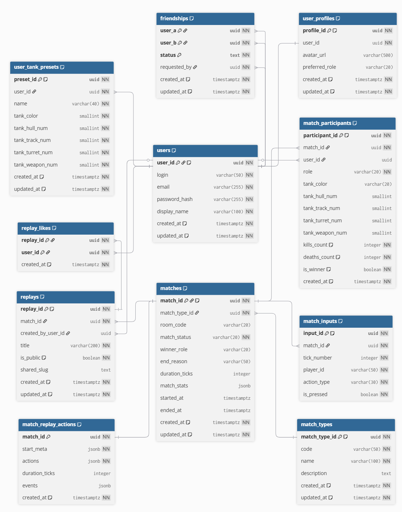

## Technology Stack

- TypeScript
- React 19 and React Router
- Webpack 5 and webpack-dev-server
- Node.js 20
- Express
- WebSocket (`ws`)
- PostgreSQL
- JWT and bcrypt
- Jest, ts-jest, and Supertest
- Docker, Docker Compose, and Nginx

## Project Structure

```text
.
|-- docker-compose.yml        # Local multi-container environment
|-- docs/images/              # README images extracted from the diploma PDF
|-- diplom/                   # Diploma materials and explanatory note
|-- frontend/                 # React client, assets, renderer, UI, Docker image
|   |-- src/ts/               # TypeScript and React source code
|   |-- src/img/              # Game sprites and UI images
|   |-- src/audio/            # Game audio assets
|   `-- webpack.config.js
`-- server/                   # Node.js server, game logic, API, tests, SQL schema
    |-- src/
    |   |-- auth/             # Authentication and JWT helpers
    |   |-- game/             # Game world, collisions, spawning, replay simulation
    |   |-- geometry/         # Geometry and collision utilities
    |   |-- repos/            # PostgreSQL repositories
    |   |-- room/             # Room lifecycle and player state
    |   |-- routes/           # REST API routes
    |   `-- ws/               # WebSocket session helpers
    |-- sql/                  # Database migrations
    `-- test/                 # Unit and integration tests
```

## Requirements

For Docker-based startup:

- Docker
- Docker Compose

For local development without Docker:

- Node.js 20 or newer
- npm
- PostgreSQL 16 or a compatible PostgreSQL version

## Quick Start with Docker

From the repository root:

```bash
docker compose up --build
```

Services:

- Frontend: `http://localhost:5173`
- Server API and WebSocket directly: `http://localhost:3000`
- PostgreSQL: `localhost:5432`

Docker Compose creates a PostgreSQL database named `tanks2d` with user `tanks` and password `tanks`. The server container runs migrations on startup. The frontend container serves static files through Nginx and proxies API/WebSocket traffic to the server container.

## Server Setup

```bash
cd server
npm ci
cp .env.example .env
npm run migrate
npm run dev
```

Set `DATABASE_URL` and `JWT_SECRET` in `server/.env` before running migrations outside Docker.

Useful server commands:

```bash
npm run build
npm start
npm run dev:watch
npm run db:seed:demo
```

Important environment variables:

- `PORT` or `SERVER_PORT`: HTTP and WebSocket port, default `3000`.
- `DATABASE_URL`: PostgreSQL connection string.
- `JWT_SECRET`: long random string used to sign authentication tokens.
- `CORS_ORIGINS`: optional comma-separated list of additional browser origins.

## Frontend Setup

Start the server first, then run the client:

```bash
cd frontend
npm ci
npm run serve
```

In development, webpack-dev-server listens on `http://localhost:8081` and proxies `/api` to `http://127.0.0.1:3000`.

Build commands:

```bash
npm run build-dev
npm run build-prod
```

The production build writes the browser bundle to `frontend/src/js/bundle.js`; the Docker image serves it with Nginx.

## Testing

Automated tests are implemented for the server:

```bash
cd server
npm run test:unit
npm run test:integration
npm test
npm run test:coverage
```

Unit tests cover geometry, collision detection and resolution, authentication helpers, room utilities, CORS behavior, game constants, WebSocket helpers, and pure repository logic. Integration tests use Supertest for the Express app; database-backed scenarios require a configured test PostgreSQL database in `server/.env.test`.

The diploma note also describes manual UI checks for login, registration, navigation, game rooms, tank customization, gameplay, match results, replay viewing, friends, and settings.

## Extracted Images

Images selected from `diplom/Записка.pdf` and saved to `docs/images`:

- `database-schema.png`
- `login-screen.png`
- `registration-screen.png`
- `home-screen.png`
- `play-mode-screen.png`
- `tank-customizer-screen.png`
- `room-screen.png`
- `gameplay-screen.png`
- `game-results-screen.png`
- `replays-screen.png`
- `replay-viewer-screen.png`
- `friends-screen.png`
- `settings-screen.png`

Images used in this README:

- All images listed above are used in the screenshots or data model sections.

Other extracted figures from the explanatory note, such as literature-review diagrams, algorithm flowcharts, duplicate screenshots, test-output captures, source-listing fragments, and the plagiarism-report image, were reviewed and discarded because they are less useful for a GitHub README.
