# 2D Tanks
___
This little project was made by two people just for fun. 
We didn't use any additional libraries or frameworks, 
everything was created by our own hands. In this game you
need to play with your friend. One gonna be attacker and the other a defender.
And before all we want to apologize for html to frontenders, cause it's new
for us, and it's written really terrible :(

## How to start playing
___
You can start playing this awesome game by the following ways:

### 1. Github pages
Just click the next [link](https://riborok.github.io/2DTanks/)
and start playing.

### 2. Clone repository
Firstly you need to follow by the next link:

https://github.com/Riborok/2DTanks

You will see github repository of this game.
Then click on the green button "Code" and then click "Download ZIP":

 

After that unzip to any convenient folder and go to it. Then launch index.html.

## How to play
___
First of all when you launch index.html you will see the next window:

There you can choose tank parts for the attacker. Choosing different parts will 
be assembled tank, whatever you want. Also, you can choose color for your tank.

Then you need to click accept button, assemble tank for the defender, and again 
click accept button. 

After that you will see the field:

On this window you can see some objects:
* Walls
  * Objects, that will block your way
* Tanks
  * These you assembled in the last stage
* Keys
* Boxes
* Header
  * Elapsed time and collected keys amount are located here

### Rules
The aim of the attacker is to collect 3 keys in three locations. After collecting
all the keys on the one location, you will pass to the next and elapsed time 
will be reset.

Defender’s goal is to prevent key collection up to 300 seconds. So the defender 
will have 3 attempts, while the attacker have only one.

### Bullet boxes

On the field you will see some coloured boxes that sometimes spawning on the
random places. Each box have relevant bullet that have different stats and
some of them - special abilities. In the next table you can see these bullets,
it's characteristics and boxes, that contain them:

| Bullet type | Box image                                                | Speed | Damage | Penetration | Mass  | Health | Abilities   |
|-------------|----------------------------------------------------------|-------|--------|-------------|-------|--------|-------------|
| Light       | 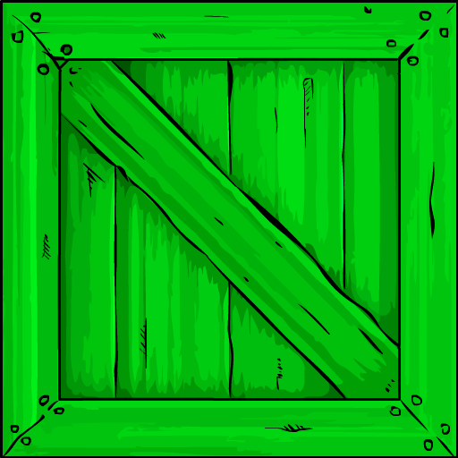     | 45    | 12     | 0.05        | 0.008 | 5      | -           |
| Medium      | 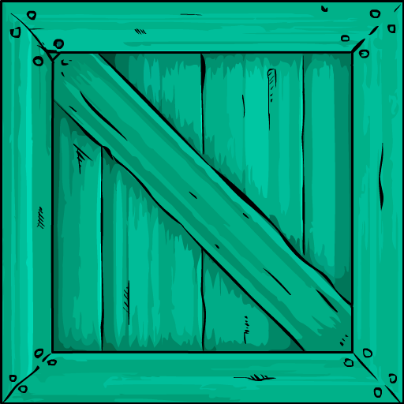   | 35    | 25     | 0.1         | 0.02  | 10     | -           |
| Heavy       | 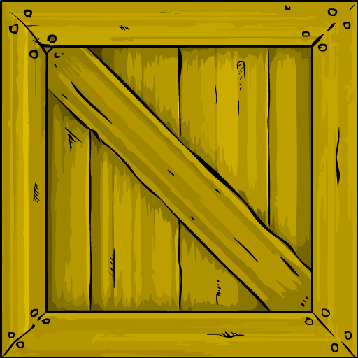     | 15    | 50     | 0.2         | 0.05  | 20     | -           | 
| Sniper      | 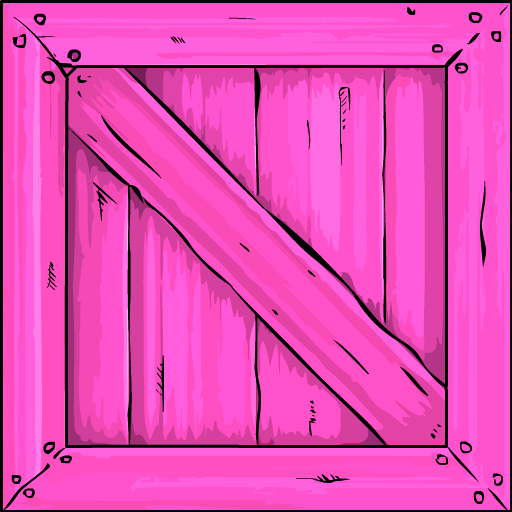   | 75    | 35     | 0.5         | 0.01  | 6      | -           |
| Grenade     | 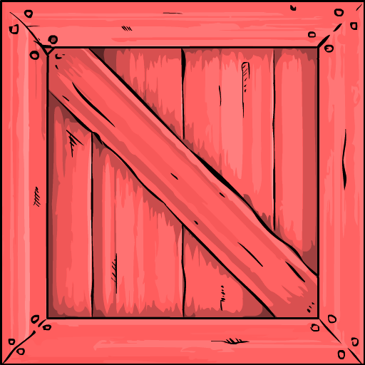 | 10    | 40     | 0.25        | 0.035 | 15     | Area damage |

## Locations
___
Except the desert you saw earlier:

You will see caves:

And also grasslands:

## Parts characteristics
___
In the next tables each tank part and it's stats will be presented.

* ### Hulls

| Hull number | Image                                                    | Health | Armor amount | Armor strength | Mass |
|-------------|----------------------------------------------------------|--------|--------------|----------------|------|
| 1           |    | 100    | 1            | 20             | 0.8  |
| 2           | 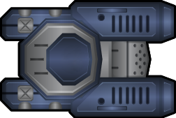  | 90     | 1.1          | 25             | 0.8  |
| 3           | 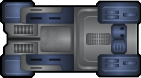   | 150    | 1            | 20             | 1.3  |
| 4           |   | 100    | 1.5          | 30             | 1.3  |
| 5           | 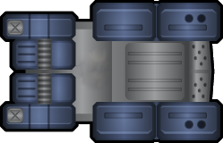   | 90     | 0.9          | 18             | 0.7  |
| 6           |    | 110    | 0.5          | 20             | 0.7  |
| 7           | 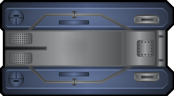 | 100    | 0.6          | 22             | 0.75 |
| 8           | 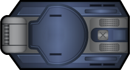  | 85     | 0.6          | 25             | 0.3  |

* ### Tracks

| Track number | Image                                                    | Angular finish speed | Angular acceleration | Forward finish speed | Forward acceleration | Backward finish speed | Backward acceleration |
|--------------|----------------------------------------------------------|----------------------|----------------------|----------------------|----------------------|-----------------------|-----------------------|
|              |                                                          |                      |                      |                      |                      |                       |                       |
| 1            |   | 0.02                 | 0.03                 | 3                    | 0.025                | 2                     | 0.02                  |
| 2            |  | 0.019                | 0.02                 | 3.5                  | 0.025                | 2.5                   | 0.02                  |
| 3            | 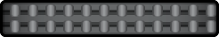  | 0.02                 | 0.02                 | 2                    | 0.035                | 1                     | 0.03                  |
| 4            | 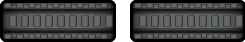 | 0.03                 | 0.04                 | 2                    | 0.015                | 1                     | 0.01                  |

* ### Turrets

| Turret number | Image                                                            | Angle speed | Mass | Bullet capacity |
|---------------|------------------------------------------------------------------|-------------|------|-----------------|
| 1             | 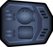   | 0.0006      | 0.25 | 3               |
| 2             | 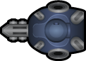  | 0.001       | 0.15 | 2               |
| 3             |    | 0.0004      | 0.3  | 5               |
| 4             |   | 0.0008      | 0.3  | 3               |
| 5             |    | 0.0005      | 0.27 | 4               |
| 6             |    | 0.0003      | 0.4  | 6               |
| 7             |  | 0.00045     | 0.32 | 5               |
| 8             |   | 0.0008      | 0.35 | 4               |

* ### Weapons

| Weapon number | Image                                                   | Penetration coeff | Damage coeff | Speed coeff | Reload speed | Mass |
|---------------|---------------------------------------------------------|-------------------|--------------|-------------|--------------|------|
| 1             |    | 1                 | 1            | 1           | 1            | 0.15 |
| 2             |   | 0.95              | 0.95         | 1.2         | 0.9          | 0.13 |
| 3             |    | 1.2               | 1.1          | 0.8         | 1.2          | 0.2  |
| 4             |   | 0.9               | 1.2          | 1           | 1.1          | 0.14 |
| 5             |    | 1.1               | 0.9          | 1           | 1            | 0.15 |
| 6             |    | 0.7               | 0.7          | 1           | 0.5          | 0.18 |
| 7             |  | 0.6               | 1.4          | 1.2         | 1.5          | 0.25 |
| 8             |   | 0.75              | 1.3          | 1.1         | 1.3          | 0.22 |

## Controls
___
* Attacker
  * Movement: WASD
  * Turret rotate: "C" - Right, "V" - Left
  * Shoot: "B"
* Defender
  * Movement: Arrows
  * Turret rotate: "," - Right, "." - Left
  * Shoot: "/"

## Authors
___
* Egor Pankratiev  
* Stanislau Habrus

## License
___
This game is released under the MIT License. For more information, check the LICENSE file.